<div align="center">

# MediVoice

### AI-Speaker–Based Nursing Information System

Turning bedside voice interactions into structured clinical documentation.

[](https://github.com/hurjun/stt-nursing-system/actions/workflows/ci.yml)
[](https://react.dev)
[](https://www.typescriptlang.org)
[](https://mui.com)
[](https://vitejs.dev)
[](./LICENSE)

**[▶ Open the live demo](https://stt-nursing-system.vercel.app)**

</div>

<p align="center">
  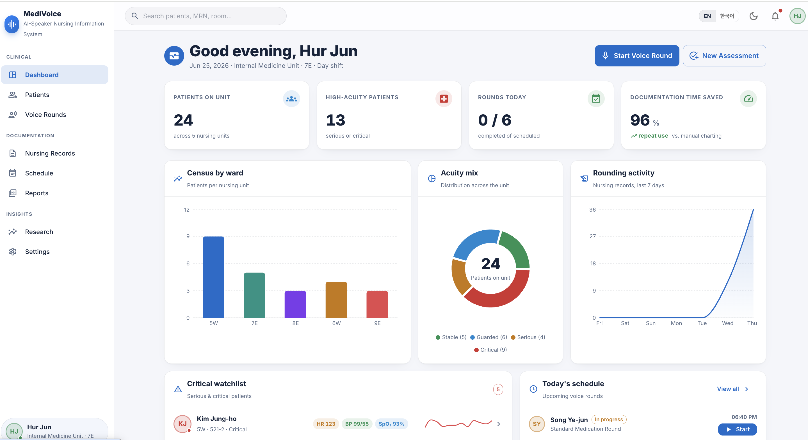
</p>
<p align="center"><sub><b>The unit dashboard</b> — census, acuity mix, 7-day rounding activity and a live critical-patient watchlist.</sub></p>

<p align="center">
  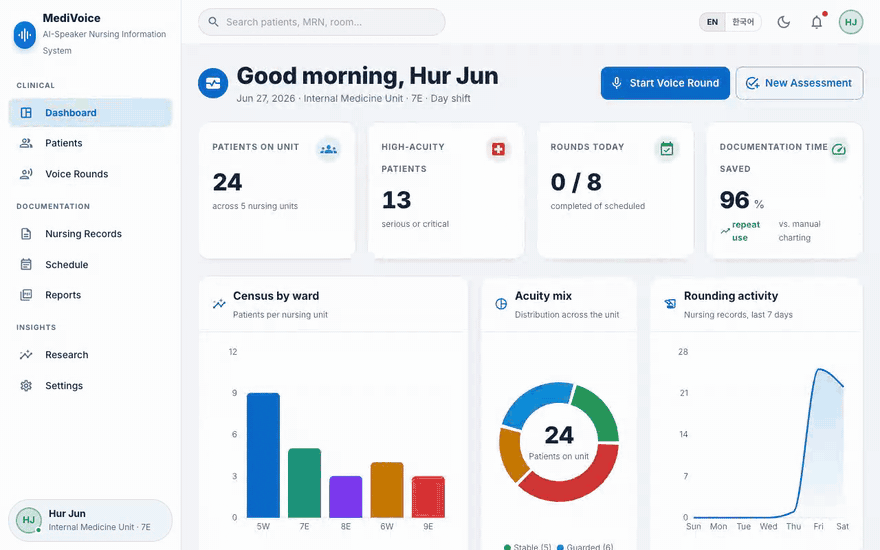
</p>
<p align="center"><sub><b>End-to-end walkthrough</b> — unit dashboard → patient roster → EMR chart → AI-speaker <b>Voice Rounds</b>, where each answer is transcribed and normalized into a chart-ready nursing entry. Recorded from the production build (<code>npm run build &amp;&amp; npm run preview</code>) driven by Playwright; Voice Rounds is shown in its built-in simulation mode.</sub></p>

---

## Overview

Nursing documentation is one of the most time-consuming parts of inpatient care. **MediVoice** explores a
voice-first alternative: at the bedside, an AI speaker asks the patient structured assessment questions
(text-to-speech), the answers are transcribed in real time (speech-to-text), and the system normalizes them
into a nursing record — which then flows into the patient chart, the rounding schedule, and exportable PDF
reports.

The app is an interactive realization of an undergraduate research project on improving nursing-record
efficiency with an AI-speaker assistant. In that study the assisted workflow cut documentation time for a
repeated assessment by **up to 96%**, and Google's Korean speech engine recognized the reference utterance with
a **0% character error rate** — both reproduced on the **Research** screen.

> Every patient, vital sign and lab value in the app is **synthetic** (generated with faker) and is for
> demonstration only.

## ✨ Highlights

- 🎙️ **Voice rounds** — an AI-speaker loop (TTS → patient answer → STT → structured record) on the Web Speech
  API, with a reliable simulation mode for presentations.
- 🩺 **EMR-grade charts** — vitals trends, lab panels with reference-range flagging, medications & MAR,
  assessment scales (Braden, Morse, GCS), intake/output and a care plan.
- 🧠 **Standardized nursing language** — NANDA diagnoses linked to **NOC** outcomes and **NIC** interventions.
- 📈 **Unit dashboard** — census, acuity mix, critical watchlist, today's schedule and recent activity.
- 📄 **PDF reporting** — one-click nursing-assessment and voice-rounding reports rendered with jsPDF.
- 🌐 **Bilingual UI (English / 한국어)** and a polished **light/dark** clinical theme.

## 📺 Walkthrough

### 🌗 Light & dark clinical theme
The whole UI ships with a polished dark theme alongside light. Here is the unit dashboard in dark
mode — the same screen the hero image above shows in light.

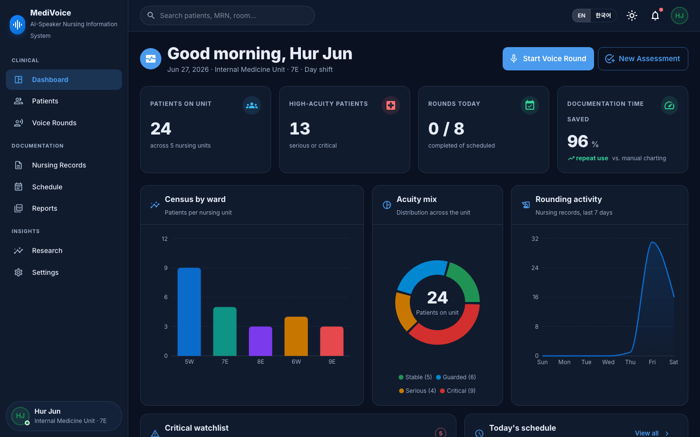

### 🧑‍⚕️ Patient roster
Filter the unit by ward, acuity or free-text search; every row opens the full chart.

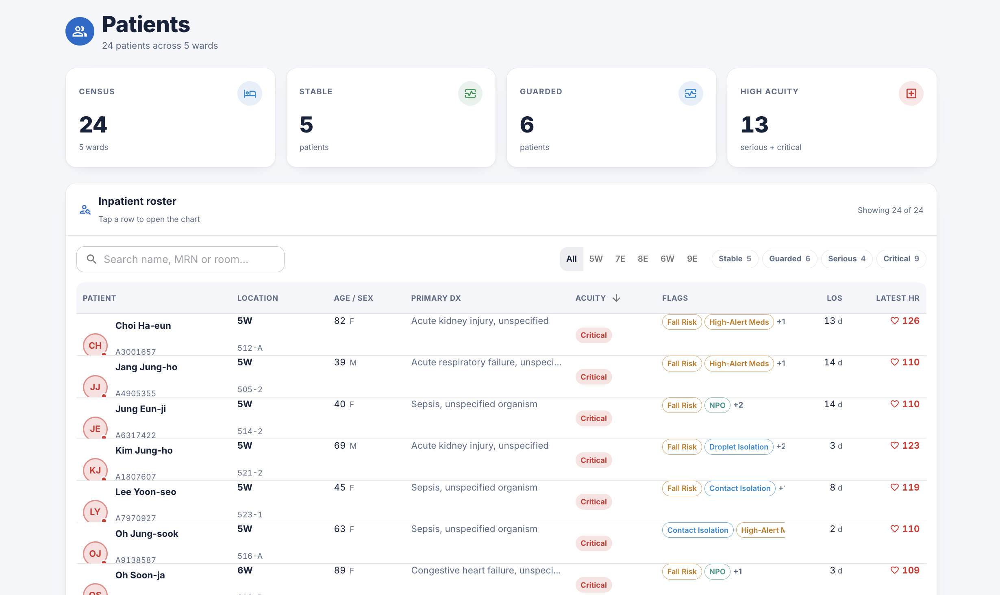

### 📋 EMR-style patient chart
Vitals trends, labs with reference-range flags, medications & MAR, NANDA diagnoses, assessment scales, care plan
and records — organized into tabs, with an allergy and risk-flag banner up top.

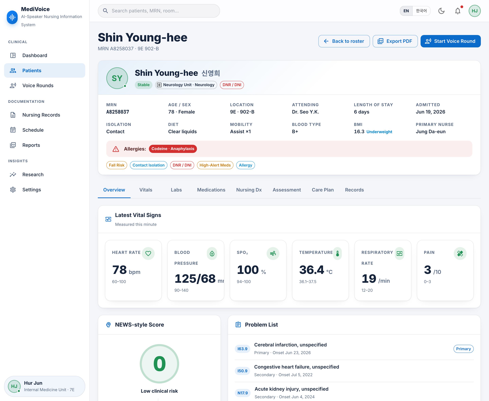

### 🎙️ Voice rounds &nbsp;·&nbsp; the centerpiece &nbsp;[`▶ try it live`](https://stt-nursing-system.vercel.app/rounds)
The AI speaker asks each question aloud (TTS); the patient's reply is transcribed (STT) with a confidence score
and normalized into a chart-ready nursing entry. A built-in simulation mode keeps the demo working without a
microphone.

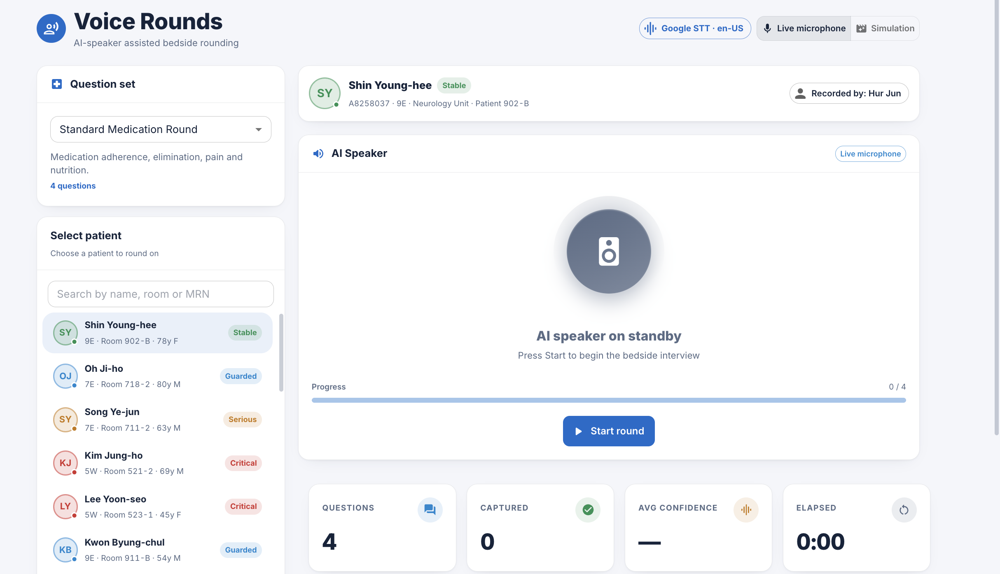

### 🗒️ Nursing records
Browse rounding and SOAP records, review the question-by-question transcript, then sign and export.

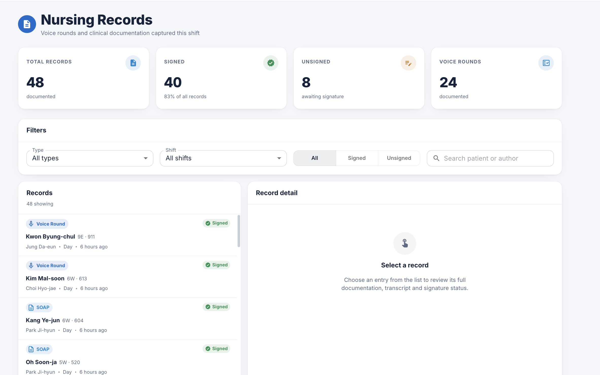

### 🗓️ Schedule
Plan rounding sessions with date/time pickers and track the day's timeline by hour.

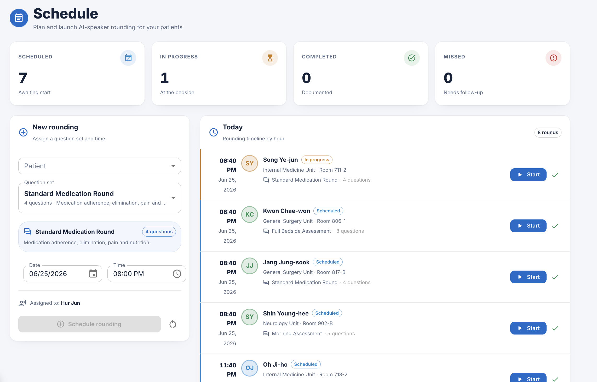

### 📄 Reports
Live PDF preview and one-click export of clinical documents.

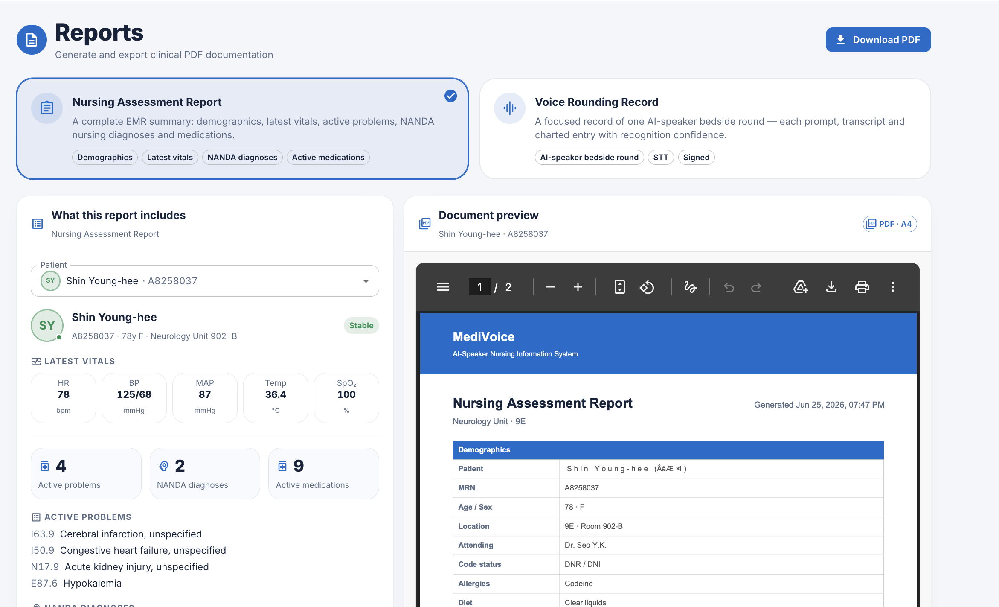

### 🔬 Research &nbsp;[`▶ open live`](https://stt-nursing-system.vercel.app/research)
The study behind the app — STT engine benchmarks, time-and-motion efficiency (≈96% reduction) and recognition
quality by patient age group.

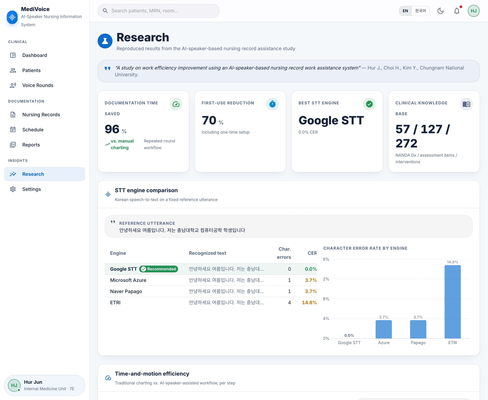

## 📑 Sample exported report

Generated entirely client-side with jsPDF — a structured nursing-assessment document with demographics, vitals,
ICD-10 problems, the NANDA → NOC linkage and the medication list.

<table>
  <tr>
    <td width="50%">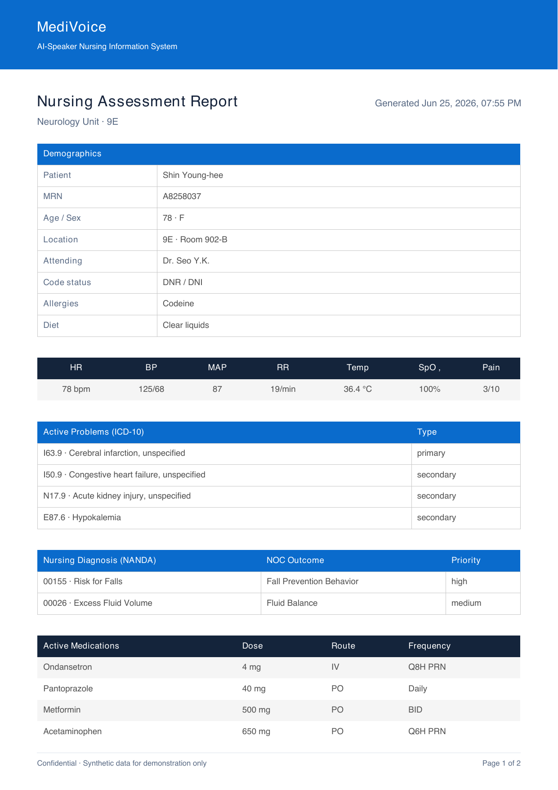</td>
    <td width="50%">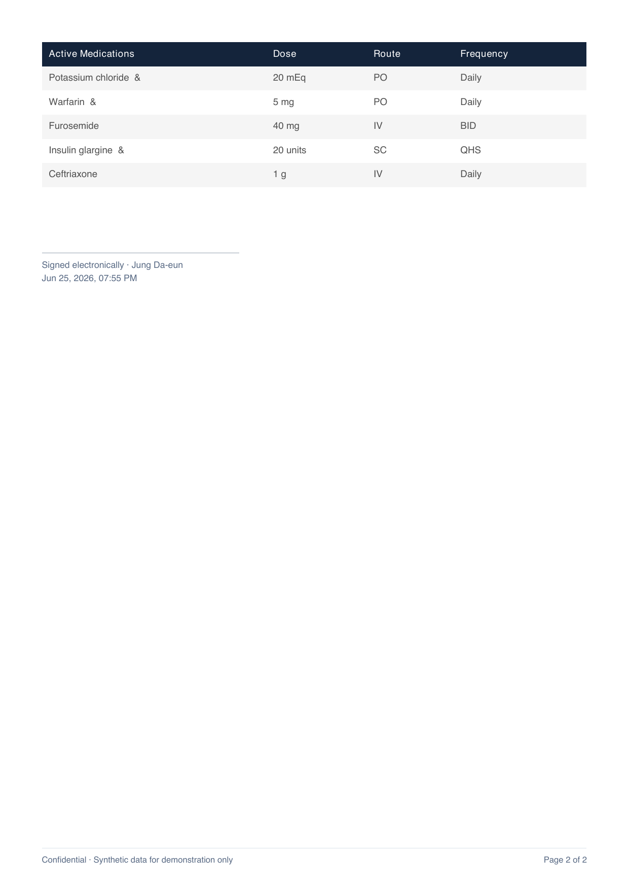</td>
  </tr>
</table>

📄 **[Download the full sample report (PDF)](docs/sample-nursing-report.pdf)**

## 🧱 Tech stack

- **React 18 + TypeScript** (strict), built with **Vite**
- **MUI v5** design system + **MUI X** Data Grid & Date Pickers
- **recharts** for clinical data visualization
- **Zustand** for application state
- **Web Speech API** for STT/TTS, **jsPDF** for report generation
- **faker** for synthetic clinical data

## 🏗️ Architecture

MediVoice is a client-only single-page app organized into clear layers — a typed
**domain model** (`types/`), curated **clinical vocabularies** and a seeded **synthetic-data**
generator (`data/`), pure **domain logic** (`lib/`), a **Zustand store** (`store/`), and one
feature module per screen (`features/`). The voice-rounds loop is the spine of the system:

```
   AI speaker ──TTS──►  patient  ──speech──►  STT (Web Speech API / simulation)
                                                   │  raw transcript + confidence
                                                   ▼
                                  normalizeAnswer()  ──►  structured, chart-ready phrase
                                                   ▼
                                       Nursing record  ──►  Zustand store
                                                   ▼
                  ┌────────────────────────────────┼────────────────────────────────┐
              Patient chart                  Rounding schedule                   PDF report
```

The pieces that carry the project's clinical credibility are pure and unit-tested: the
transcript→structured-record normalization (`lib/rounding.ts`), the clinical scoring and
lab/vital flagging (`lib/clinical.ts`), and the character-error-rate metric behind the research
benchmark (`lib/cer.ts`).

## 🚀 Getting started

```bash
# install
npm install

# run the dev server (http://localhost:5173)
npm run dev

# type-check and build for production
npm run build

# preview the production build
npm run preview
```

Requires Node.js ≥ 18.18. Speech recognition uses the browser's Web Speech API (best supported in Chromium-based
browsers); when it is unavailable, Voice Rounds automatically falls back to simulation mode.

## 🧪 Testing & CI

```bash
npm test            # run the Vitest suite once
npm run test:watch  # watch mode
npm run test:coverage
```

The suite (Vitest) targets the domain logic the project's credibility rests on — clinical
scoring and lab/vital flagging (`lib/clinical.ts`), the transcript→structured-record
normalization (`lib/rounding.ts`), the character-error-rate metric used in the research
benchmark (`lib/cer.ts`), date/number formatting (`lib/format.ts`), the Zustand reducers
(`store/`), and invariants of the synthetic-data generators and the rounding-question catalog
(`data/`). The benchmark tests **recompute** the headline "0% CER on the reference utterance"
from the implemented metric rather than trusting the hardcoded numbers.

Every push and pull request runs [GitHub Actions](.github/workflows/ci.yml) on Node 20:
`typecheck → lint → test → build`.

## 📁 Project structure

```
src/
├── app/          application shell, routing, layout
├── theme/        clinical MUI theme (light/dark) and design tokens
├── i18n/         English/Korean internationalization
├── types/        clinical domain model
├── data/         curated clinical vocabularies + synthetic data generation
├── store/        Zustand store and selector hooks
├── lib/          clinical scoring, formatting, speech (STT/TTS), PDF
├── components/   shared UI building blocks
└── features/     one module per screen
```

## 🙏 Acknowledgements

This project builds on the graduation research *"A study on work efficiency improvement using an AI-speaker–based
nursing-record work assistance system"* by **Hur Jun, Choi Hyo-jae, and Kim Yul**. Clinical terminology follows
the NANDA-I / NOC / NIC standardized nursing languages.

## License

Released under the [MIT License](./LICENSE).
